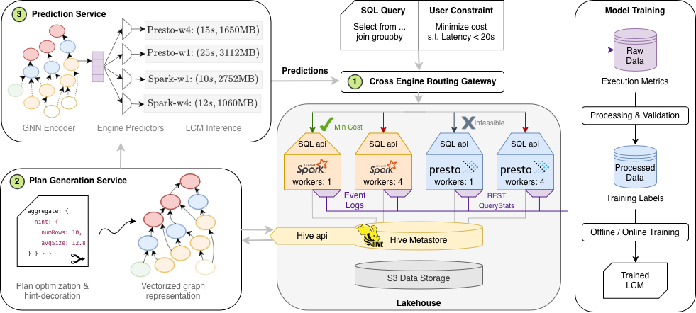

# QueryPARCEL

**Provisioning-Aware Routing and Cost Estimation in Lakehouses**

Companion repository for the VLDB paper:
> *Provisioning-Aware Query Routing Across Heterogeneous Lakehouse Engines*
> Shaswat Gupta, Michael E. Nidd, Ioana Giurgiu — IBM Research Europe, Zürich

---

## What is in this repository

Core model classes (GNN encoder, feature engineering, routing logic) are proprietary to IBM and are **not included**. This repository provides the artifacts, data, and supplementary material needed to understand and reproduce the experimental setup described in the paper.

| Artifact | Path | Description |
|----------|------|-------------|
| Trained model checkpoint | [`checkpoints/`](checkpoints/) | Best model weights (~500k params) |
| Training script | [`scripts/train_multi_metric.py`](scripts/train_multi_metric.py) | End-to-end multi-task training loop |
| Training config | [`config/`](config/) | Hyperparameters for the winning run |
| ETL pipeline | [`flexdata_metric_prediction/input_data_warehouse/etl_pipeline/`](flexdata_metric_prediction/input_data_warehouse/etl_pipeline/) | Converts raw engine telemetry to processed training CSVs |
| Processed metrics | [`flexdata_metric_prediction/input_data_warehouse/processed_metrics/`](flexdata_metric_prediction/input_data_warehouse/processed_metrics/) | Per-query time & memory labels across all engine configs |
| SQL queries | [`flexdata_metric_prediction/input_data_warehouse/queries/`](flexdata_metric_prediction/input_data_warehouse/queries/) | TPC-H and TPC-DS query corpus |
| Query plans | [`flexdata_metric_prediction/query_plans/`](flexdata_metric_prediction/query_plans/) | Substrait logical plans (JSON) for TPC-H, TPC-DS, and IMDB JOB |
| Inference demo | [`notebooks/inference_demo.ipynb`](notebooks/inference_demo.ipynb) | Walkthrough of model loading and prediction |

---

## Online Appendix

The full supplementary material for the paper is available in [`appendix/`](appendix/), covering model architecture, engine configurations, datasets, cluster details, and zero-shot transfer analysis.

**[Browse the Online Appendix →](appendix/README.md)**

---

## License

See [CONTRIBUTING.md](CONTRIBUTING.md) for contribution guidelines.