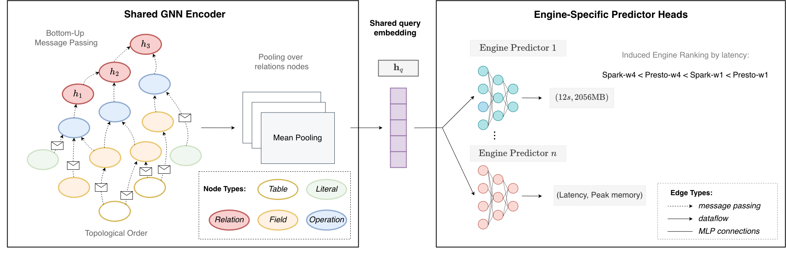
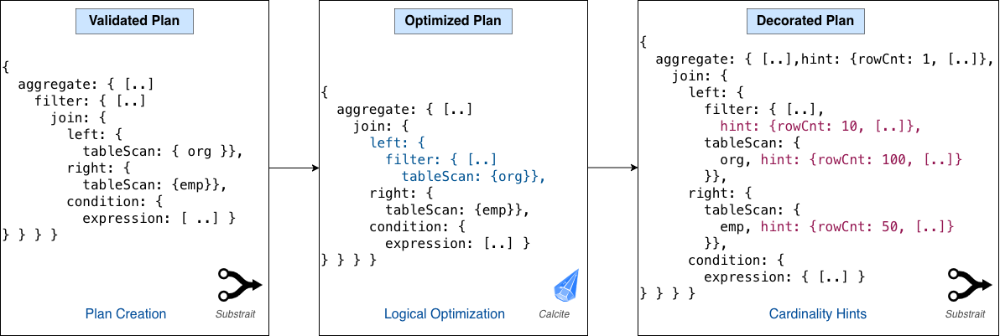
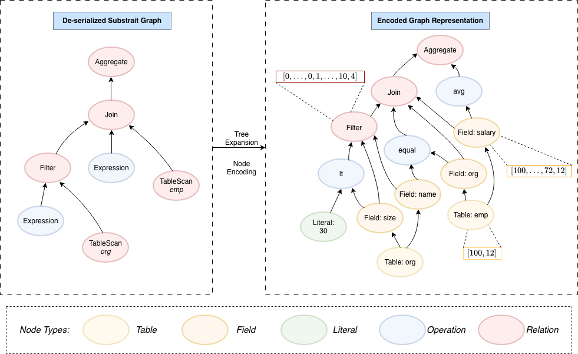

# Appendix: Model Architecture and Training Configuration

This appendix provides a complete specification of the **BottomUpGNN** cost model architecture, feature encoding scheme, label normalization pipeline, and all training hyperparameters used in the paper.



---

## A.1  Graph Representation

Query execution plans are parsed from Substrait protobuf format and converted into **heterogeneous graphs** with five node types and directed edges encoding structural relationships.



### A.1.1  Node Types

| Node Type | Description | Example contents |
|-----------|-------------|-----------------|
| `RelNode` | Relational operators | `filter`, `project`, `aggregate`, `sort`, `fetch`, join variants |
| `TableNode` | Scanned base tables | Table references in the `FROM` clause |
| `FieldNode` | Column references | Columns in `SELECT`, `WHERE`, `GROUP BY`, `ORDER BY` |
| `OPNode` | Scalar operators and functions | Arithmetic, comparison, string, datetime, cast, subquery |
| `LiteralNode` | Constant scalar values | Literal integers, strings, dates |



### A.1.2  Edge Types

Eight directed edge types model bottom-up information flow from leaves toward the root:

| Source → Target | Semantics |
|-----------------|-----------|
| `RelNode → RelNode` | Parent–child relation between relational operators |
| `RelNode → OPNode` | Relational operator produces/uses a scalar expression |
| `OPNode → RelNode` | Scalar expression feeds into a relational operator |
| `OPNode → OPNode` | Nested scalar expression composition |
| `FieldNode → OPNode` | Column reference feeds a scalar operator |
| `FieldNode → RelNode` | Column reference feeds a relational operator directly |
| `TableNode → FieldNode` | Table ownership of a column |
| `LiteralNode → OPNode` | Literal constant feeds a scalar operator |

All edge types use the **same** `LinearAggregate` message-passing kernel (sum aggregation, optionally degree-normalized) as their convolution operator.

---

## A.2  Feature Encoding (HintEncoder)

The `HintEncoder` converts each node into a fixed-length real-valued feature vector using the plan's optimizer-provided statistics (*hints*).

### A.2.1  RelNode Features

| Component | Encoding | Dimensionality |
|-----------|----------|----------------|
| Relation type | One-hot | 8 (indices 0–7: `filter`, `sort`, `project`, `cross`/`JOIN_TYPE_UNSPECIFIED`, `JOIN_TYPE_INNER`, `JOIN_TYPE_LEFT`/`RIGHT`, `aggregate`, `fetch`) |
| `rowCount` | $\log(1 + x)$ | 1 |
| `avgSize` | $\log(1 + x)$ | 1 |

**Total: ~10 dimensions**

### A.2.2  TableNode Features

| Component | Encoding | Dimensionality |
|-----------|----------|----------------|
| `rowCount` | $\log(1 + x)$ | 1 |
| `avgSize` | $\log(1 + x)$ | 1 |

**Total: 2 dimensions**

### A.2.3  FieldNode Features

| Component | Encoding | Dimensionality |
|-----------|----------|----------------|
| `colType` | One-hot over type vocabulary | 7 (int/integer/bigint, double/fp64, char/varchar/string, decimal/date, timestamp, boolean, null) |
| `numNulls` | $\log(1 + x)$ | 1 |
| `numDVs` (distinct values) | $\log(1 + x)$ | 1 |
| `avgColLen` | $\log(1 + x)$ | 1 |
| `maxColLen` | $\log(1 + x)$ | 1 |

**Total: ~11 dimensions**

### A.2.4  OPNode Features

| Component | Encoding | Dimensionality |
|-----------|----------|----------------|
| Operator type | One-hot over operator vocabulary | ~22 (covering subquery types, generic ops `cast`/`if_clause`/`if_then`, arithmetic functions, comparison functions, string functions, aggregate functions) |

**Total: ~22 dimensions**

### A.2.5  LiteralNode Features

| Component | Encoding | Dimensionality |
|-----------|----------|----------------|
| Value type | One-hot over type vocabulary (same as FieldNode) | 7 |
| `length` | Raw float | 1 |
| `is_casted` | Binary flag | 1 |

**Total: ~9 dimensions**

> All missing hint values are substituted with safe defaults (e.g., `avgSize=0`, `rowCount=0`, `avgColLen=8`, `numNulls=0`) to ensure consistent feature vector lengths across query plans and schemas.

---

## A.3  Model Architecture

### A.3.1  Overview

The model follows a **three-stage** architecture:

1. **Per-node embedding** (`hidden_mlp`): project each node's raw feature vector into a shared embedding space.
2. **Bottom-up message passing** (`conv` + `out_mlp`): propagate embeddings from leaf nodes to the root following tree depth order.
3. **Graph-level prediction** (`classifier` → per-engine `head`): pool the root-level embedding and produce per-engine metric predictions.

```
Raw node features
       │
       ▼  (per node-type hidden_mlp, node-type-specific weights)
Node embedding  ──────────────────────────────────────────►  h_v  (dim 112)
       │
       ▼  (bottom-up message passing, one pass per depth level)
  LinearAggregate (sum) over children  ──►  agg_v  (dim 112)
  concat([h_v, agg_v])                 ──►  (dim 224)
  out_mlp                              ──►  updated h_v  (dim 112)
       │
       ▼  (mean pooling over all RelNodes, weighted by 1/depth)
  Graph embedding  (dim 112)
       │
       ▼  classifier (final_mlp)
  graph repr  (dim 112)
       │
   ┌───┴────────────────────────────────┐
   ▼                                    ▼
head[presto-w1]                   head[spark-w4] ...
 [time, memory]                    [time, memory]
```

### A.3.2  MLP Layer Structure

The MLP module used throughout the model constructs layers as follows (given `input_dim`, `hidden_dim`, `num_layers`, `width_factor`, `output_dim`):

```
Layer 0:   input_dim  →  hidden_dim
Layer i:   hidden_dim * width_factor^(i-1)  →  hidden_dim * width_factor^i   (for i in 1..num_layers)
Layer N+1: hidden_dim * width_factor^num_layers  →  output_dim
```

All intermediate layers are followed by the configured activation and dropout. The final output layer has **no activation**.

### A.3.3  Per-Component Configuration

#### Hidden-State MLP (`hidden_mlp`)
Applied once per node to project its raw features into the shared embedding space. **One per node type** (node-type-specific weights).

| Parameter | Value |
|-----------|-------|
| Activation | GELU |
| Input dim | Varies per node type (see §A.2) |
| Hidden dim | 112 |
| `num_layers` (intermediate layers) | 1 |
| `width_factor` | 1.15 |
| Output dim | **112** |
| Dropout | 0.0 |
| Total intermediate layers | 3 (input→112, 112→128, 128→112) |

#### Out MLP (`out_mlp`)
Applied after message aggregation; input is the concatenation of node embedding + aggregated child embeddings. **One per node type**.

| Parameter | Value |
|-----------|-------|
| Activation | LeakyReLU |
| Input dim | 224 (= 2 × 112, concat of node embedding + child aggregate) |
| Hidden dim | 168 |
| `num_layers` | 0 |
| `width_factor` | 1.0 |
| Output dim | **112** (forced equal to `hidden_mlp.output_dim`) |
| Dropout | 0.0 |
| Total layers | 2 (224→168, 168→112) |

#### Classifier / Final MLP (`final_mlp`)
Takes the mean-pooled RelNode embedding as input and produces a graph-level representation.

| Parameter | Value |
|-----------|-------|
| Activation | LeakyReLU |
| Input dim | 112 |
| Hidden dim | 112 |
| `num_layers` | 0 |
| `width_factor` | 1.0 |
| Output dim | **112** |
| Dropout | 0.0 |
| Total layers | 2 (112→112, 112→112) |

#### Per-Engine Prediction Head (`head`)
One independent head per engine, outputting per-engine metric predictions from the 112-dim graph representation.

| Parameter | Value |
|-----------|-------|
| Activation | LeakyReLU |
| Input dim | 112 |
| Hidden dim | 84 |
| `num_layers` | 1 |
| `width_factor` | 0.7 |
| Output dim | **2** (time + memory) |
| Dropout | 0.0 |
| Total layers | 3 (112→84, 84→58, 58→2) |

### A.3.4  Message Passing

**Type:** `HeteroConv` with `LinearAggregate` per edge type, global aggregation `sum`.

**`LinearAggregate`** is a sum-aggregation `MessagePassing` layer (no learnable parameters). In the winning configuration `normalize_mp=False`, so messages are simply summed without degree normalization.

**Execution order:** Strictly bottom-up by tree depth. At each depth level $d$ (from deepest leaf to root), only edges whose target node has depth $d$ are active. This ensures information flows from leaves to root in $O(\text{tree\_depth})$ message-passing steps.

### A.3.5  Graph Pooling

**Mean pooling over `RelNode`s**, weighted by inverse depth:

$$\mathbf{z}_{\text{graph}} = \frac{1}{|V_{\text{rel}}|} \sum_{v \in V_{\text{rel}}} \mathbf{h}_v \cdot \frac{1}{d_v}$$

where $d_v$ is the depth of RelNode $v$ and $\mathbf{h}_v$ is its final embedding. This downweights representations of deeply nested sub-plans relative to shallower (more summarizing) operators.

### A.3.6  Multi-Head Output

Time complexity of the forward pass is $O(|V| + |E|)$ overall.

| Component | Details |
|-----------|---------|
| Number of heads | 4 (one per engine: `presto-w1`, `presto-w4`, `spark-w1`, `spark-w4`) |
| Output per head | 2 values (time, memory) |
| Total output | $4 \times 2 = 8$ scalar predictions per query |
| Architecture | Shared graph encoder + independent per-engine heads |

---

## A.4  Label Normalization

Targets are normalized prior to training using a three-step pipeline applied independently per (engine, metric) pair.

**Step 1 — Median Aggregarion:**
Aggregate values $y$ across 3 runs for each query on each engine.

**Step 2 — Log transformation:**
$$z = \log(y + \varepsilon), \quad \varepsilon = 10^{-8}$$

**Step 3 — Z-score normalization:**
$$\tilde{z} = \frac{z - \mu}{\sigma}$$

where $\mu$ and $\sigma$ are the mean and standard deviation of $z$ over the **training split only**.

At inference, predictions are inverse-transformed as:
$$\hat{y} = \exp(\tilde{z} \cdot \sigma + \mu)$$

Failed runs (NaN labels) are masked out during loss computation and do not contribute to gradient updates.

---

## A.5  Training Configuration

### A.5.1  Dataset

Joint training on TPC-H (~1,960 queries) and TPC-DS (~4,388 queries), totalling ~6,348 queries split 80/10/10 (train/val/test) per schema. Four target engines (`presto-w1`, `presto-w4`, `spark-w1`, `spark-w4`) × 2 metrics (elapsed time, peak memory). See [Appendix A4](A4_Datasets.md) for full dataset details.

### A.5.2  Optimization

| Parameter | Value |
|-----------|-------|
| Optimizer | AdamW |
| Learning rate | $10^{-3}$ |
| Weight decay | $0.01$ |
| Batch size | 64 |
| Max epochs | 1000 |
| Gradient clip norm | 1.0 |
| Precision | `float64` |
| Device | CPU |
| Random seed | 123 |

### A.5.3  Learning Rate Schedule & Early Stopping

| Parameter | Value |
|-----------|-------|
| Scheduler | `ReduceLROnPlateau` (factor 0.5, patience 25, cooldown 25) |
| Early stopping patience | 50 epochs |
| Monitored metric | Validation loss |

### A.5.5  Loss Function

**Huber loss** on normalized log-space predictions, applied jointly over all engines and metrics:

$$\mathcal{L}_{\delta}(\hat{z}, z) = \begin{cases} \frac{1}{2}(\hat{z} - z)^2 & \text{if } |\hat{z} - z| \leq \delta \\ \delta \left(|\hat{z} - z| - \frac{\delta}{2}\right) & \text{otherwise} \end{cases}$$

| Parameter | Value |
|-----------|-------|
| $\delta$ (Huber threshold) | 2.0 |
| Aggregation | Mean over all (engine, metric, sample) combinations |
| NaN handling | NaN labels are masked out before loss computation |

Equal weights (0.5 each) are assigned to elapsed time and peak memory.

## A.6  Evaluation Metrics

The primary evaluation metric is the **Q-error** (quantile error), computed in raw (untransformed) space after inverse-normalizing predictions:

$$\text{Q-error}(\hat{y}, y) = \max\!\left(\frac{\hat{y}}{y},\ \frac{y}{\hat{y}}\right) \geq 1$$

A Q-error of 1.0 indicates a perfect prediction. Q-error is reported as median and mean across the test set, broken down by engine, metric, and overall.

Routing quality is evaluated with four downstream tasks post-training:

| Task | Description |
|------|-------------|
| `MIN_TIME` | Select engine with minimum predicted time |
| `MIN_COST` | Select engine with minimum predicted monetary cost |
| `MIN_COST_TIME_SLO` | Minimize cost subject to a time SLO |
| `MIN_TIME_COST_SLO` | Minimize time subject to a cost SLO |

SLO percentiles evaluated: 50th, 75th, 90th.

---

## A.7  Parameter Count Summary

Approximate parameter count for the winning run (~500k parameters, 112-dim embeddings):

| Component | Description | Approx. Parameters |
|-----------|-------------|-------------------|
| `hidden_mlp` × 5 node types | 3-layer MLP per node type, input→112→128→112 | ~5 × (input×112 + 112×128 + 128×112) ≈ variable |
| `out_mlp` × 5 node types | 2-layer MLP per node type, 224→168→112 | ~5 × (224×168 + 168×112) ≈ ~283k |
| `classifier` (final_mlp) | 2-layer MLP, 112→112→112 | ~25k |
| `head` × 4 engines | 3-layer MLP per engine, 112→84→58→2 | ~4 × (112×84 + 84×58 + 58×2) ≈ ~60k |
| **Total** | | **~500k** |
