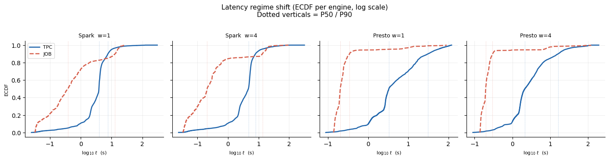

### Quantifying workload shift

We quantify the shift between the training workloads (TPC-H/TPC-DS) and JOB using only observed latencies across the four engines. First, JOB occupies a distinct latency regime: per-engine ECDFs of $\log_{10} t(q,e)$ (Figure 1) show mass concentrated in the sub-second range, with large quantile ratios $Q_{0.5}^{\text{TPC}}/Q_{0.5}^{\text{JOB}}$ and $Q_{0.9}^{\text{TPC}}/Q_{0.9}^{\text{JOB}}$ (Table 1). Second, routing-relevant structure also shifts: the identity of the oracle fastest engine $e^*(q)$ and the winner margin $m(q)=(t_{(2)}-t_{(1)})/t_{(1)}$ differ between workloads, yielding a nontrivial total-variation distance between winner distributions. These diagnostics support that JOB constitutes an out-of-distribution workload relative to the TPC training data.

## Quantifying Workload Distribution Shift (TPC → JOB)

### Goal

IMDB-JOB is treated as an onboarding workload that is out-of-distribution (OOD) relative to the TPC-H/TPC-DS training workloads. Here we quantify this shift using only observed runtimes across our four engine configurations. We focus on latency (not memory), since the salient shift in JOB is the sub-second execution regime and its impact on routing.

### Methodology

For each query–engine pair $(q,e)$ we use the measured wall-clock execution latency $t(q,e)$ from single-tenant evaluation runs (same setup as in the main evaluation). To compare workloads, we aggregate TPC-H and TPC-DS into a single `TPC` workload, and treat IMDB-JOB as `JOB`. We report:
- Distributional visualizations via ECDFs of $\log_{10} t$
- Scale-robust statistical distances computed on the same log scale

### Latency regime shift (bulk and tail)

The ECDFs of $\log_{10} t(q,e)$ for `TPC` and `JOB` per engine show that JOB shifts the *bulk* of the latency mass sharply downward. Median runtimes are $10\times$–$23\times$ smaller on JOB than on TPC, depending on engine (Table 1). Importantly, the shift is *not* a uniform rescaling: tail behavior changes as well. For Presto, JOB also reduces tail latencies substantially (e.g., P90 in the few-hundred-ms range), whereas for Spark the JOB distribution is bimodal-like—a sub-second median coexisting with a heavy high-latency tail (P90 $\approx 12$–$14$s). This tail inflation is consistent with JOB operating in a regime where fixed engine overheads, startup costs, and run-to-run variance can dominate for many queries even when the median is sub-second.

**Table 1:** Latency quantiles (seconds) by engine and workload, and quantile ratios between TPC and JOB. Median ratios capture the bulk regime shift; P90 ratios reveal tail-shape changes (e.g., Spark has heavier tails on JOB).

| Engine | TPC (SF10) Median | TPC P90 | TPC P99 | JOB (IMDB) Median | JOB P90 | JOB P99 | $Q_{0.5}^{\text{TPC}}/Q_{0.5}^{\text{JOB}}$ | $Q_{0.9}^{\text{TPC}}/Q_{0.9}^{\text{JOB}}$ |
|--------|-------------|---------|---------|-------------|---------|---------|---------|---------|
| Spark w=1  | 3.881 | 7.593 | 30.129 | 0.382 | 12.904 | 22.222 | 10.16× | 0.59× |
| Spark w=4  | 4.665 | 7.989 | 43.216 | 0.207 | 13.537 | 27.549 | 22.54× | 0.59× |
| Presto w=1 | 3.290 | 31.044 | 101.400 | 0.203 | 0.347 | 27.841 | 16.18× | 89.38× |
| Presto w=4 | 2.140 | 16.240 | 93.600 | 0.197 | 0.295 | 39.870 | 10.86× | 55.02× |

### Distributional separation on log-latency

To quantify separation without being dominated by absolute time scale, we compute two-sample distances on $\log_{10} t$. Table 2 reports the Kolmogorov–Smirnov (KS) statistic between the `TPC` and `JOB` log-latency distributions, along with Cohen's $d$ (standardized mean difference) on the same scale. Across all engines, the KS statistics are large (0.64–0.90; mean 0.80), and effect sizes are large (Cohen's $d$ 1.2–2.4), indicating substantial distributional shift. (P-values are included for completeness; with thousands of samples they are uniformly near zero.)

**Table 2:** Two-sample separation between TPC and JOB log-latency distributions. KS is computed on $\log_{10} t$; Cohen's $d$ is the standardized mean difference on $\log_{10} t$.

| Engine | $n_{\text{TPC}}$ | $n_{\text{JOB}}$ | KS | p-value | $\Delta \mu$ (TPC–JOB) | Cohen's $d$ |
|--------|-------------|---------|---------|---------|---------|---------|
| Spark w=1  | 7,374 | 799 | 0.644 | $6.13 \times 10^{-288}$ | +0.790 | 1.20 |
| Spark w=4  | 7,388 | 799 | 0.752 | $< 10^{-320}$ | +1.043 | 1.56 |
| Presto w=1 | 6,920 | 728 | 0.895 | $< 10^{-320}$ | +1.248 | 2.41 |
| Presto w=4 | 7,181 | 732 | 0.898 | $< 10^{-320}$ | +1.052 | 2.16 |
| **Mean** | — | — | **0.797** | — | — | — |

### Implication for onboarding

These diagnostics support that JOB differs materially from the TPC training workloads in the routing-relevant latency regime:
1. The bulk of runtimes shifts by an order of magnitude
2. The tail shape differs by engine (notably, heavier Spark tails on JOB)

This motivates treating JOB as an onboarding scenario where zero-shot transfer is unreliable and a small amount of fine-tuning data is required to re-anchor latency prediction and downstream routing decisions.